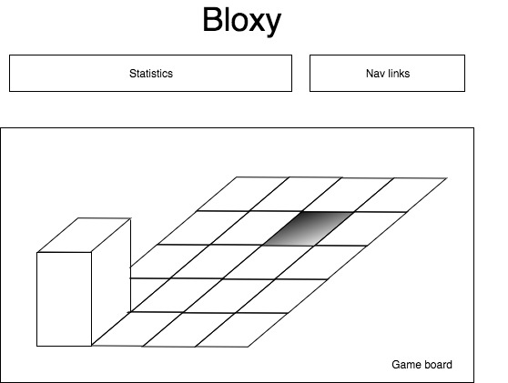

## Bloxy (based on the block game Bloxorz)

### Background

Bloxy (and its inspiration, Bloxorz) is a 3D block manipulation game. Each level
has a 2x1x1 block, a board of square tiles, and a square hole; the aim is to
manipulate the block to get it to fall into the square hole. This aim gets harder
to achieve as you progress through the game. The player rolls the block around
using the arrow keys, either in a vertical state (like :) or a horizontal state
(like ..), and loses by falling into the oblivion at the edge of the board.
Certain special tiles--bridges, bridge activators, fragile tiles--either
facilitate or hinder the block's movement.

### Functionality & MVP
Players will be able to:
- [ ] Move the 3D block around on a board of tiles
- [ ] Lose the game by falling off the board and thereby reset the level
- [ ] Win the game by falling through the square hole and proceed to the next level
- [ ] Use bridges and fragile tiles to help/hurt their level progression

In addition, this project will include:
- [ ] An optional About modal
- [ ] A production Readme

### Wireframes

The app will consist of a single screen with game board, game statistics, and
nav links to the Github, my Linkedin, and an optional About modal. Game statistics
include the level number, the number of attempts so far of that level, the total
time spent so far on that level, and then number of moves (which resets with each
death).

### Architecture and Technologies

This project will be implemented with the following technologies:

- React for overall structure and game logic,
- `Three.js` with `HTML5 Canvas` for DOM manipulation and rendering,
- Webpack to bundle and serve up the various scripts.

In addition to the webpack entry file, there will be four scripts involved in
this project:

`game.js`: this script will keep track of the number of moves on the current
level. When the player wins, it will replace the won level with the next one;
when the player loses, it will reset the level and block.

`board.js`: this script will handle the logic for creating and updating the
necessary `Canvas` elements and rendering them to the DOM.

`tile.js`: Each tile will have a `type`: either regular, empty space (when the
block lands on them, it falls off into oblivion), a bridge activator (when the
block lands on them, a nearby bridge appears), part of a bridge (only appear
when a bridge activator has been hit, otherwise act like empty space--necessary
for joining two unjoined sections of the board), and fragile (if a block stands
upright on it, the tile will break and the block will fall through). A tile will
be `active` when the block is on top of it and will act accordingly (activating
a bridge if it is a bridge activator, e.g.).

`block.js`: this script will house the constructor and move functions for the
`Block` object. The block will store `blockAPos` and `blockBPos` the x and y
positions, typically next to each other, of its two subblocks (if those two
positions are the same, the block is vertical). The move function will listen
for arrow keys from the user and update the block's position accordingly.

### Implementation Timeline

**Day 1**: Set up all necessary Node modules, including getting webpack up and
running and `Three.js` installed. Create `webpack.config.js` as well as
`package.json`. Write a basic entry file and the bare bones of the four scripts above.

- Get a green bundle with `webpack`
- Learn enough `Three.js` to render a block to the `Canvas` element and to be able
to flip it using the arrow keys.

**Day 2**: Build out the basic `Tile` class and then differentiate between the
different types. Make sure that the block can interact with each type of tile.
Goals for the day:

- Master `Three.js`
- Make all block-tile interactions work

**Day 3**: Create three (or more if time) boards made of tiles and a block. Write
the win/lose logic for a game. Goals for the day:
- Be able to win a level and move on to a new level
- Be able to lose a level and reset that level

**Day 4**: Run through the gameplay, making sure it is intuitive and fun. Style the frontend, making it polished and professional. Goals for the day:
- Make the falling-block event look realistic
- Have a styled, nice-looking, intuitive `Canvas` and game experience in general.

### Bonus features

There are some other features that more advanced versions of the game implement,
and which may eventually appear in Bloxy:

- [ ] Splitter tile: when hit, the tile splits the block into two and moves one
of those blocklets away; the two rejoin automatically into one block when next
to each other. Only the joined block may win the level.
- [ ] Differentiated bridge activators--some activate a bridge only once, while
others activate and disactivate a certain bridge each time the block hits them.
